# Evaluación del Modelo — Guía de Visualizaciones

**Contenido**: 14 gráficas organizadas en 4 categorías que cubren rendimiento por fold, análisis temporal, comparaciones de rendimiento y diagnósticos de entrenamiento.

---

## Categoría 1: Métricas de Regresión

### 1.1 R² Scores por Fold

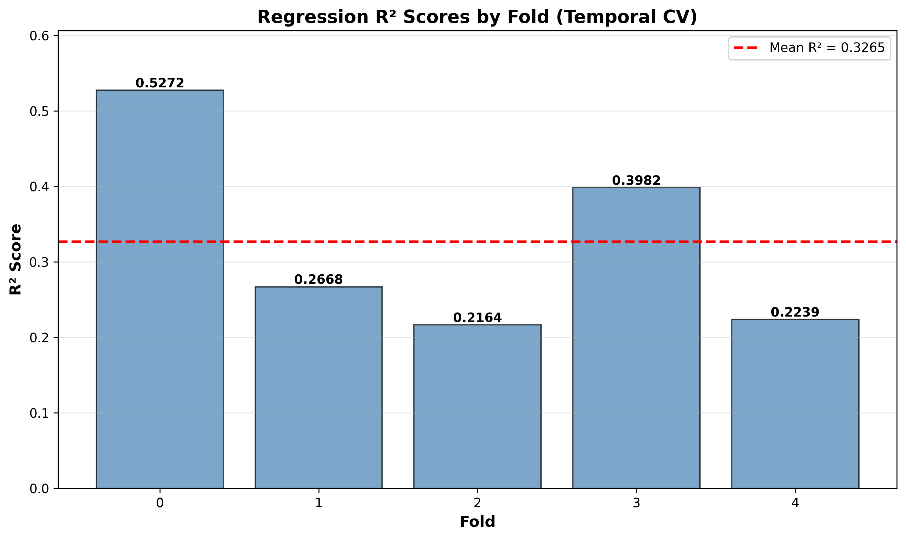

**Qué representa**: Coeficiente de determinación (R²) para cada fold. La línea roja punteada es la media.

**Propósito**: Evaluar qué fracción de la varianza de la volatilidad real explica el modelo en cada periodo temporal. Identificar qué regímenes de mercado son más predecibles.

**Lectura**: Fold 0 (crisis 2008) domina con R²=0.527; folds 2 y 4 (periodos tranquilos y producción) caen a ~0.22. La amplitud entre el mejor y peor fold (0.31) refleja que la predictibilidad depende fuertemente del régimen de mercado.

---

### 1.2 MAE vs RMSE por Fold

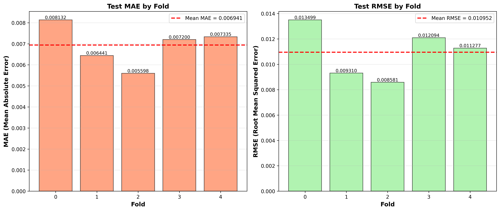

**Qué representa**: Mean Absolute Error (izquierda) y Root Mean Squared Error (derecha) por fold, con líneas de media.

**Propósito**: Comparar el error absoluto promedio vs el error cuadrático. La diferencia entre MAE y RMSE revela la presencia de outliers de error.

**Lectura**: Fold 2 tiene el MAE más bajo (0.0056) pero el peor R² — el error absoluto es bajo solo porque la volatilidad del periodo es baja. Fold 0 tiene el MAE más alto (0.0081) pero el mejor R². El RMSE es consistentemente ~55-60% mayor que el MAE en todos los folds, indicando colas pesadas en los errores.

---

### 1.3 Heatmap de Métricas

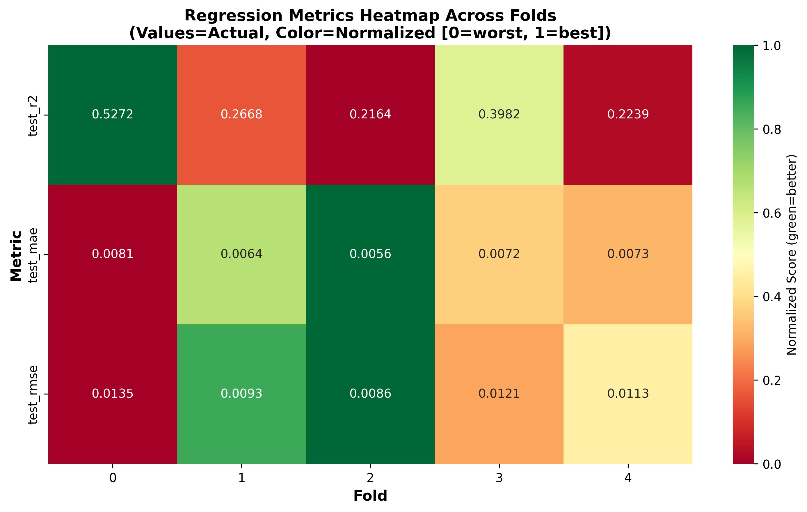

**Qué representa**: Matriz de las 3 métricas (R², MAE, RMSE) normalizadas por fold. El color indica rendimiento relativo (verde = mejor, rojo = peor). Los valores escritos son los reales.

**Propósito**: Vista rápida de qué folds son consistentemente buenos o malos a través de todas las métricas.

**Lectura**: Fold 0 es verde en R² (mejor) pero rojo en MAE/RMSE (peor error absoluto). Fold 2 es rojo en R² (peor) pero verde en MAE/RMSE (menor error absoluto). Esto confirma que MAE/RMSE solos no evalúan calidad predictiva — hay que contextualizarlos con la volatilidad del periodo.

---

## Categoría 2: Análisis Temporal

### 2.1 Línea de Tiempo Temporal de Folds

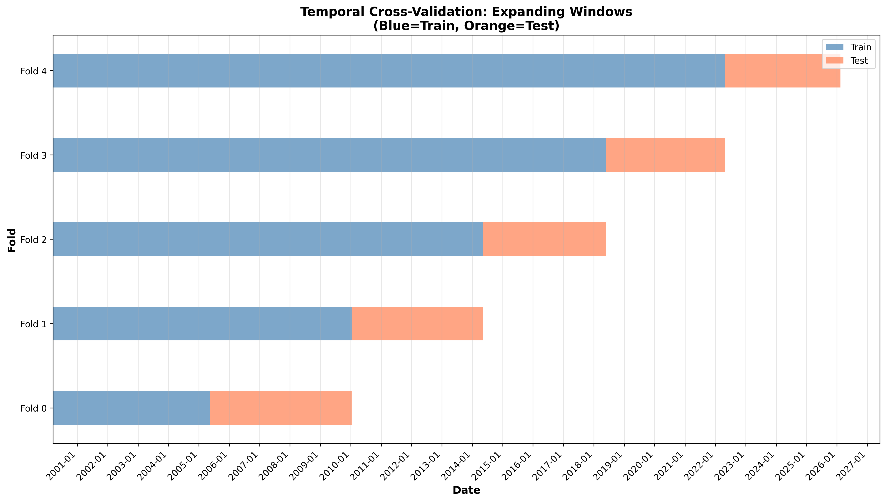

**Qué representa**: Las ventanas de entrenamiento (azul) y prueba (naranja) para cada fold en escala de tiempo.

**Propósito**: Verificar la integridad del diseño de validación temporal — que no hay overlaps entre train y test, que el gap de 5 días existe, y que el patrón expanding window es correcto.

**Lectura**: Cada fold entrena con todo el pasado hasta su fecha de corte y prueba con datos futuros. Train crece acumulativamente (expanding window) mientras test avanza. El gap entre train y test de cada fold asegura separación temporal.

---

### 2.2 Distribución de Muestras por Fold

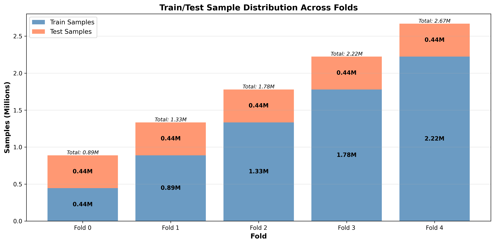

**Qué representa**: Cantidad de muestras de entrenamiento y prueba por fold, en millones.

**Propósito**: Mostrar el desbalance de datos de entrenamiento entre folds y verificar que el test set es constante.

**Lectura**: Entrenamiento crece de 0.44M (fold 0) a 2.22M (fold 4). Test set constante en ~0.44M. Fold 4 entrena con 5× más datos que fold 0 pero tiene peor R² — más datos no compensan la menor predictibilidad del periodo.

---

### 2.3 Tendencia Temporal de Métricas

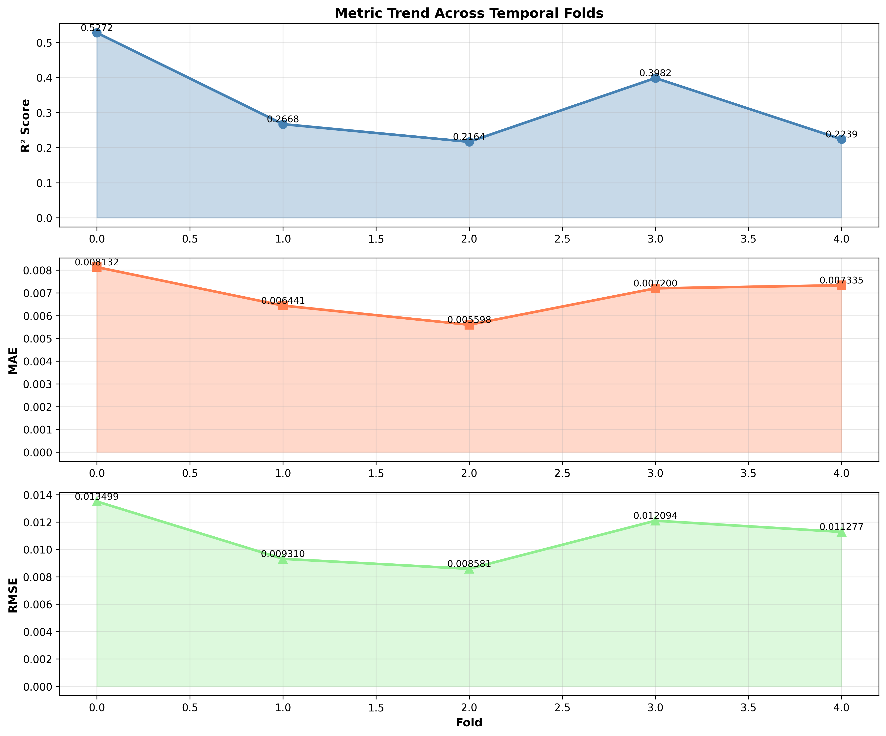

**Qué representa**: Evolución de R², MAE y RMSE a través de los folds (0→4), con área sombreada.

**Propósito**: Detectar degradación de rendimiento del modelo a través del tiempo y correlacionar con eventos de mercado.

**Lectura**: R² muestra un patrón de "doble U" — picos en folds de crisis (0 y 3), valles en periodos tranquilos (1, 2, 4). MAE y RMSE muestran el patrón inverso (bajan en calma, suben en crisis). Esto confirma que el modelo es más útil en periodos de estrés de mercado.

---

## Categoría 3: Comparaciones de Rendimiento

### 3.1 Comparación de Métricas (Normalizado)

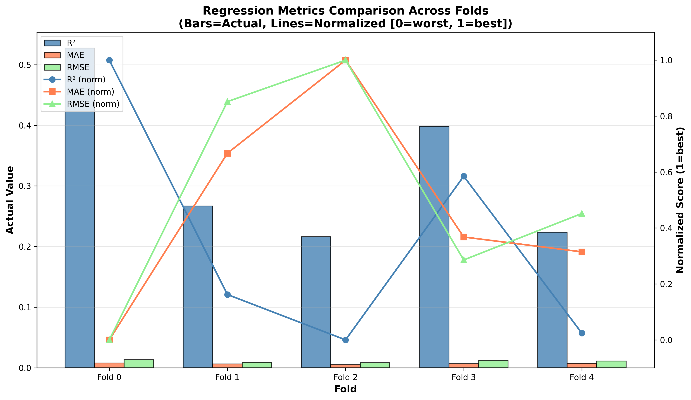

**Qué representa**: Las 3 métricas como barras agrupadas (valores absolutos) con líneas superpuestas de scores normalizados [0, 1] en el eje secundario.

**Propósito**: Visualizar el ranking relativo de cada fold en todas las métricas simultáneamente.

**Lectura**: Fold 0 tiene la barra más alta en R² (mejor) pero también la más alta en MAE/RMSE (peor error absoluto). La línea naranja (MAE normalizado) muestra que fold 2 es el mejor en error absoluto. Ningún fold domina en todas las métricas.

---

### 3.2 Tiempo de Entrenamiento vs Inferencia

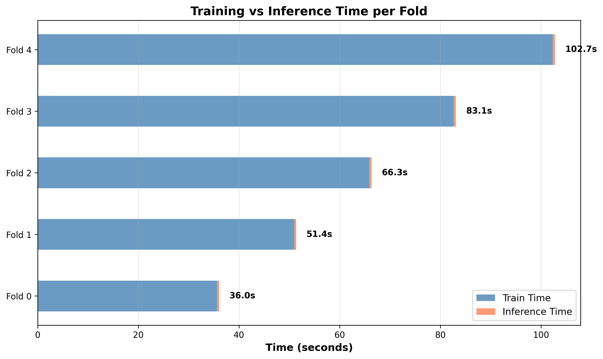

**Qué representa**: Barras horizontales apiladas de tiempo de entrenamiento (azul) e inferencia (naranja) por fold.

**Propósito**: Identificar cuellos de botella computacionales y escalabilidad del entrenamiento con el volumen de datos.

**Lectura**: El entrenamiento escala sub-linealmente con los datos: fold 4 (5× datos que fold 0) toma solo ~7.5× más tiempo. La inferencia es constante (~0.32s por fold) porque el test set es del mismo tamaño. El entrenamiento domina el tiempo total (~99%). Sin ticker encoding, el tiempo total se redujo 63% vs one-hot.

---

### 3.3 Distribución de Samples

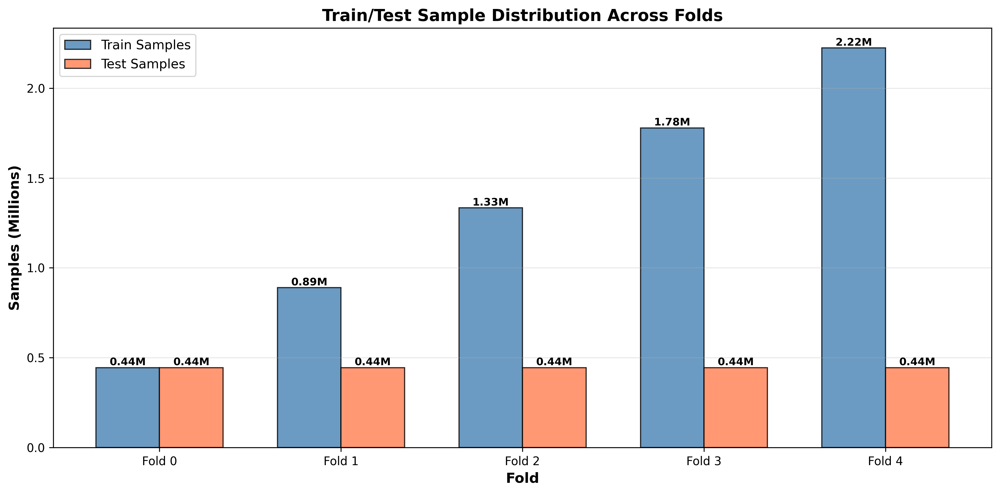

**Qué representa**: Barras agrupadas de muestras de entrenamiento vs prueba por fold.

**Propósito**: Verificar el diseño experimental — test set constante, train creciente.

**Lectura**: Test set plano en todas las folds (~0.44M). Train crece linealmente. Esto significa que fold 0 evalúa en ~50% de sus datos disponibles (444K train, 444K test), mientras fold 4 evalúa solo en ~17% (2.22M train, 444K test). La proporción test/total decrece de 0.5 a 0.17.

---

### 3.4 Composición de Features

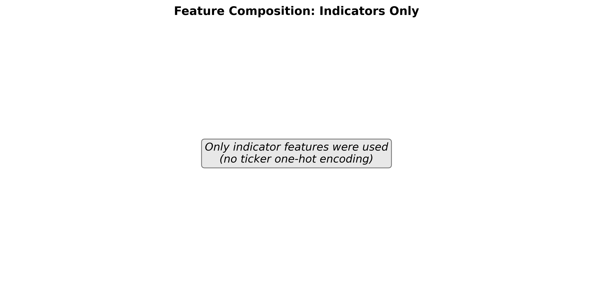

**Qué representa**: Número de features indicadores vs features de ticker utilizados por el modelo.

**Propósito**: Documentar la arquitectura de features del modelo final y contrastar con la versión anterior (one-hot).

**Lectura**: 29 features indicadores, 0 ticker dummies. Sin one-hot encoding. La versión anterior usaba ~496 features (29 indicadores + 467 ticker). La simplificación mejoró R² (+3.6%), redujo tiempo (-63%) y eliminó el sobreajuste a tickers individuales.

---

## Categoría 4: Diagnósticos de Entrenamiento

### 4.1 Real vs Predicho (Scatter)

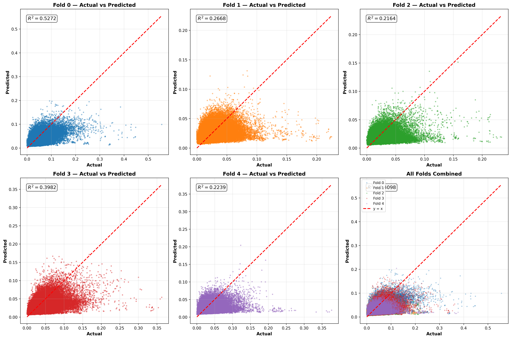

**Qué representa**: Para cada fold (y combinado), scatter plot del valor real de volatilidad (eje x) vs el valor predicho (eje y). La diagonal roja es la referencia de predicción perfecta.

**Propósito**: Diagnosticar sesgos sistemáticos, sub/sobre-estimación, y rango de predicciones.

**Lectura**: 
- **Fold 0**: puntos dispersos pero bien alineados con la diagonal (buen R²). El modelo captura tanto valores bajos como altos.
- **Fold 1**: sesgo de sobrestimación visible — muchos puntos sobre la diagonal (fold predice más volatilidad de la que ocurre).
- **Fold 3**: ligera subestimación en valores altos — puntos bajo la diagonal en volatilidades > 0.05.
- **Fold 4**: el modelo comprime el rango de predicción — la nube es más angosta verticalmente que la diagonal, indicando que no predice valores extremos.
- **Combinado**: fold 0 (azul) domina la cola derecha (alta volatilidad). El modelo completo tiene correlación Pearson=0.64 con el real.

---

### 4.2 Distribución de Residuos

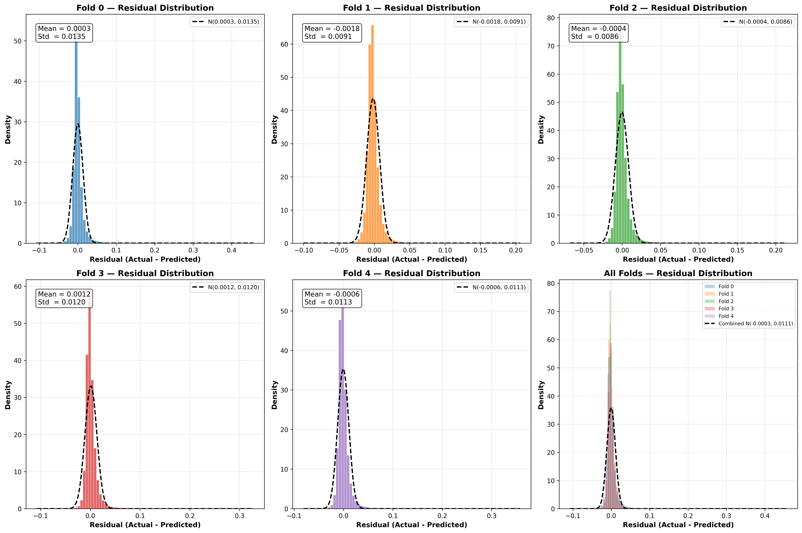

**Qué representa**: Histograma de residuos (real - predicho) por fold con ajuste de distribución normal superpuesto (línea negra punteada).

**Propósito**: Evaluar si los errores del modelo están centrados en cero y si siguen una distribución normal (errores i.i.d.).

**Lectura**:
- **Fold 0**: residuos centrados en 0 (media=0.0003), distribución ancha (std=0.0135). Colas ligeramente pesadas.
- **Fold 1**: sesgo negativo (media=-0.0018) — el modelo sobreestima sistemáticamente. La distribución está desplazada a la izquierda.
- **Fold 2**: mejor comportamiento — centrado en 0, distribución angosta (std=0.0086).
- **Fold 3**: ligero sesgo positivo (media=0.0012) — subestimación.
- **Fold 4**: centrado (media=-0.0006), distribución moderada.
- Fold 1 es el único con sesgo relevante (0.2 desviaciones estándar). Los residuos no siguen una normal perfecta (colas más pesadas), lo que es esperable para volatilidad financiera.

---

### 4.3 Importancia de Features

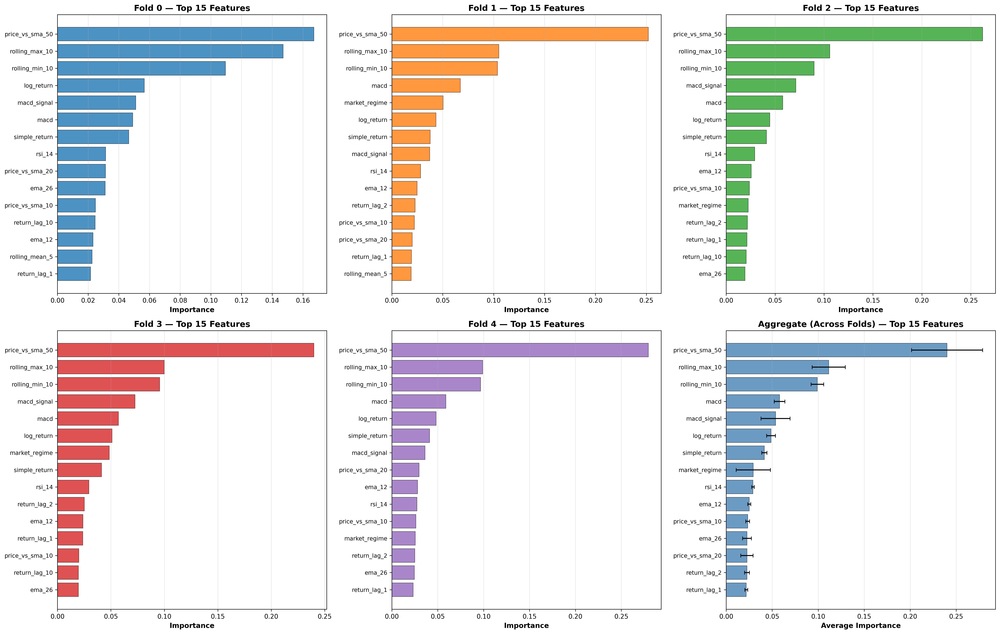

**Qué representa**: Top 15 features más importantes por fold (barras horizontales) según `feature_importances_` de XGBoost (ganancia promedio normalizada de splits). El último panel muestra el promedio a través de los 5 folds con barras de error (±1 std).

**Propósito**: Identificar qué indicadores financieros son los predictores más consistentes de volatilidad y si la importancia es estable entre regímenes de mercado.

**Lectura**:
- `price_vs_sma_50`: feature dominante en todos los folds (17-28% de importancia). Su importancia crece en folds recientes (28% en fold 4 vs 17% en fold 0).
- `rolling_max_10` y `rolling_min_10`: segundo y tercero, estables (~10-15% cada uno).
- Las 3 features principales son las mismas en todos los folds — las relaciones aprendidas son estables temporalmente.
- El panel agregado muestra que las barras de error son pequeñas para el top 5 — estos features son consistentemente importantes sin importar el régimen.
- `log_return`, `rsi_14`, `volume_zscore` están en el top 10 pero no en el top 3. Son relevantes pero secundarios frente a las features de tendencia.

---

### 4.4 Error por Decil de Volatilidad

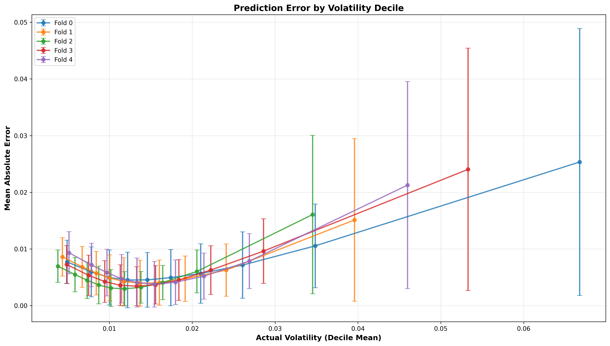

**Qué representa**: Mean Absolute Error agrupado por deciles de la volatilidad real, con una línea por fold. Las barras de error muestran ±1 desviación estándar dentro de cada decil.

**Propósito**: Diagnosticar si el modelo funciona uniformemente a través de la distribución de volatilidad o si degrada en valores extremos.

**Lectura**:
- El error crece monótonamente con la volatilidad en todos los folds — es universalmente más difícil predecir valores extremos con precisión absoluta.
- Fold 0 (crisis 2008) tiene la pendiente más pronunciada: el error en el decil más alto (~0.020) es ~5× el error del decil más bajo (~0.004).
- Fold 2 (periodo tranquilo) tiene la pendiente más suave — la distribución de volatilidad es más angosta, por lo que el rango de errores también lo es.
- Las barras de error se ensanchan en deciles altos — hay más variabilidad en el error cuando la volatilidad es alta.
- Implicación práctica: para muestras de alta volatilidad, no solo el error promedio es mayor, sino que es menos confiable (mayor varianza).
